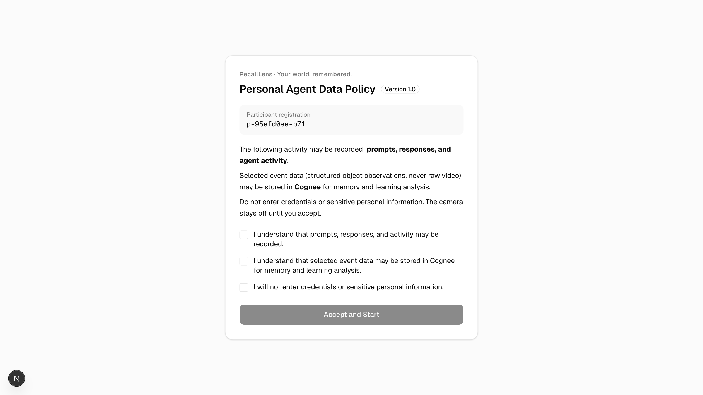
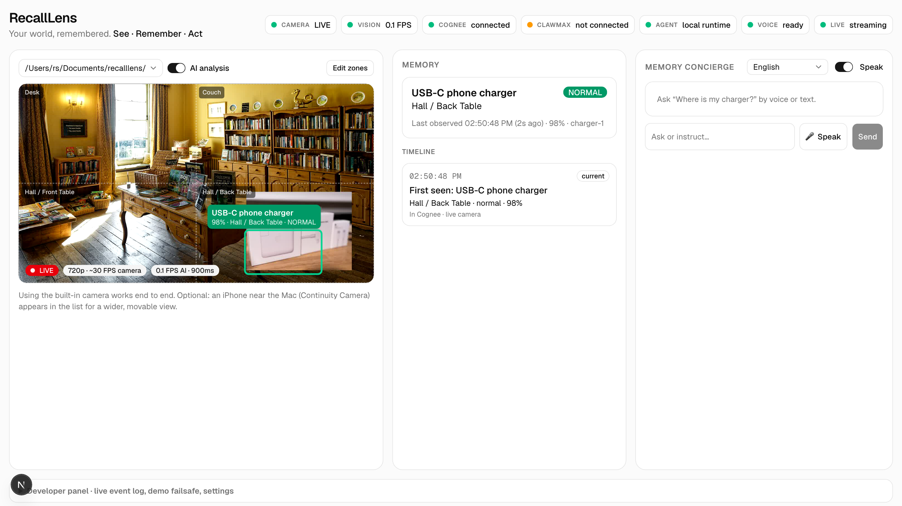
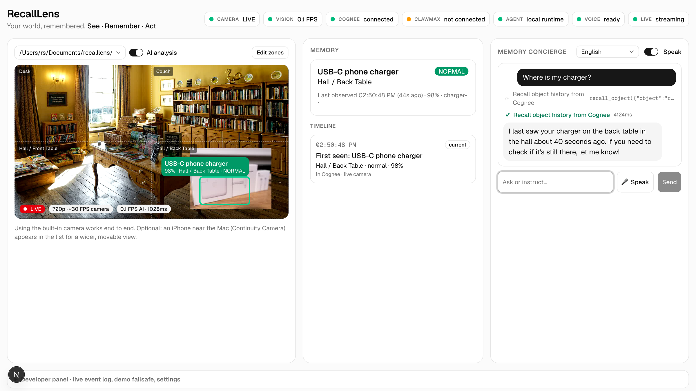
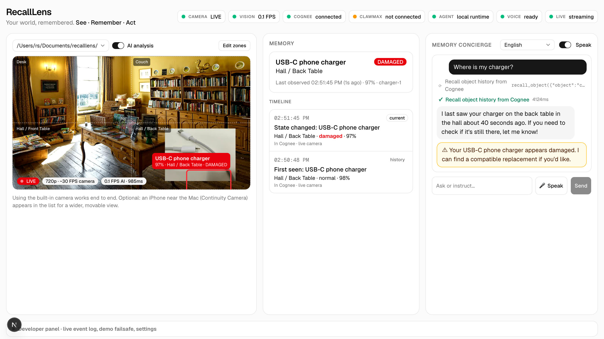
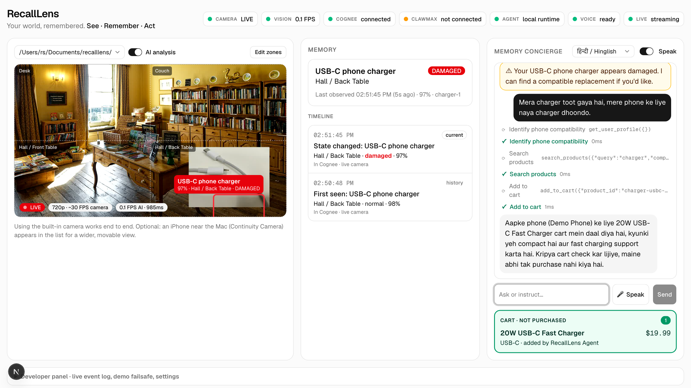
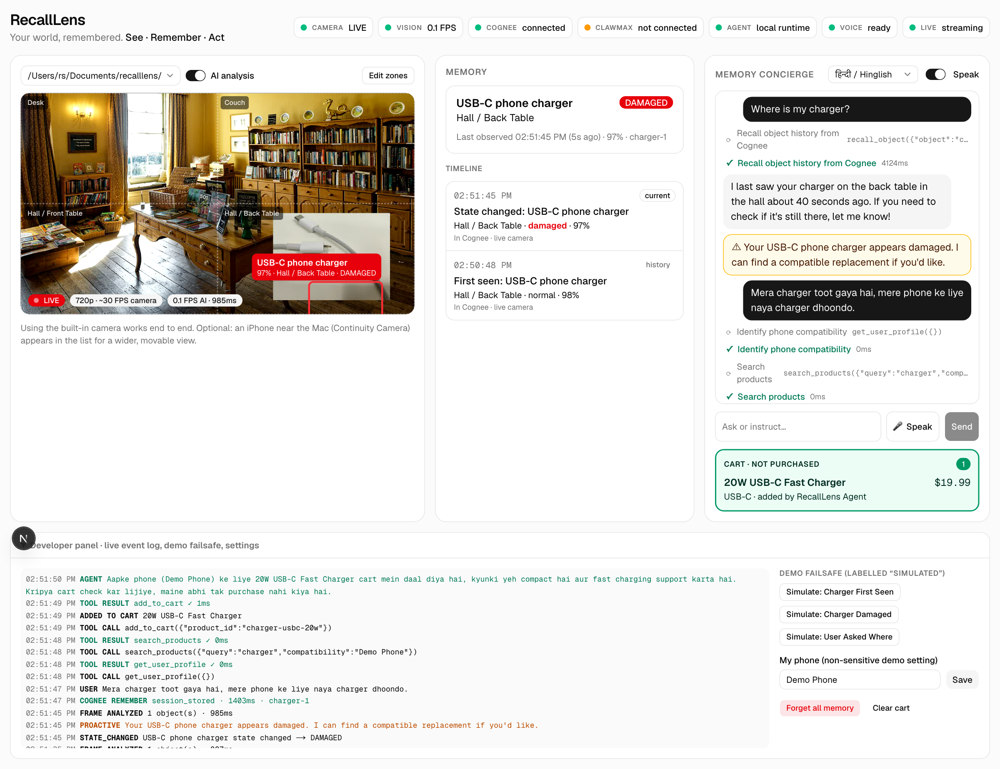
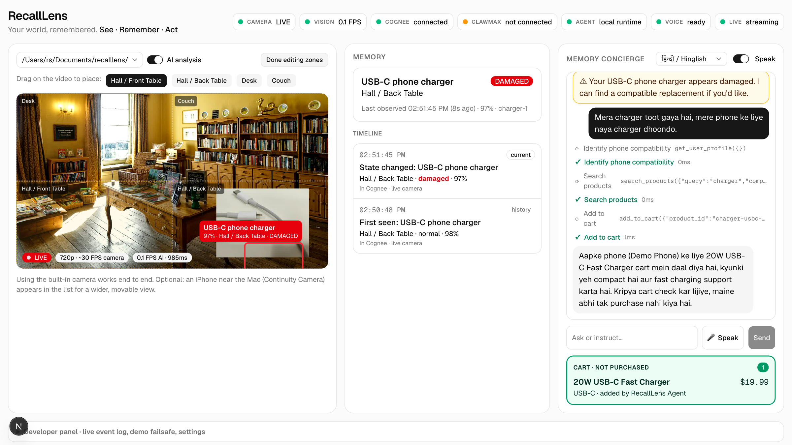
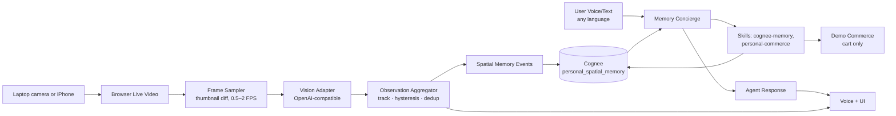

# RecallLens

**Your world, remembered.** See · Remember · Act

RecallLens is a personal spatial memory agent. A camera (your laptop webcam or an iPhone today, smart glasses tomorrow) watches your space; RecallLens turns what it sees into a small set of meaningful, timestamped observations, stores them in **Cognee**, and lets a **ClawMax** agent recall them and act on them.

> "Where is my charger?" → *"I last saw your USB-C charger on the back table in the hall, about two minutes ago."*
> The charger turns out to be damaged → *"Mera charger toot gaya hai, naya dhoondo"* → the agent finds a compatible replacement and adds it to a cart. It never purchases.

A personal memory and assistance system. Not a medical or diagnostic device.

## Screenshots

Captured automatically by the end-to-end run (`npm run e2e`). Real app, real vision, real Cognee, real agent; the "camera" is a synthetic test stream (a room photo with a charger photo on the back table), fed to Chromium as its webcam.

| | |
|---|---|
| **1. Consent gate** Policy v1.0, participant id, three required acknowledgements; camera stays off until accepted. | **2. See + remember** Live camera, zone overlay and detection; the observation is written to Cognee. |
|  |  |
| **3. Recall** "Where is my charger?" → agent recalls from Cognee and answers with place and time. | **4. Notice** The charger is now broken: state changes to DAMAGED, one proactive notice. |
|  |  |
| **5. Act** Hinglish request → phone compatibility → product search → add to cart. Not purchased. | **6. Proof** Developer panel: every hop in the live event log, plus the labelled demo failsafe. |
|  |  |
| **7. Calibrate** Drag to place each named zone over the camera view. | |
|  | |

## Architecture



| Layer | What it does | Where |
|---|---|---|
| **See** | Camera at native FPS; only changed frames (768 px JPEG, q0.6) go to vision, ~1.2–1.6 s each with `gpt-4.1` | `components/LiveCamera.tsx`, `lib/sampling.ts`, `lib/vision.ts` |
| **Understand** | Per-frame detections → stable object ids, zones, and only `FIRST_SEEN / MOVED / STATE_CHANGED / REAPPEARED / DISAPPEARED` events | `lib/aggregator.ts`, `lib/zones.ts` |
| **Remember** | Durable events written to Cognee (session → permanent), recalled as exact chunks and sorted by timestamp | `lib/cognee.ts`, `lib/pipeline.ts` |
| **Act** | Memory Concierge agent with tools: recall, current view, profile, product search, add to cart | `lib/agent.ts`, `lib/tools.ts`, `clawmax/` |

### Why Cognee
Cognee is the durable, queryable memory layer: `remember` with a `session_id` returns in ~2–3 s and Cognee merges it into the permanent graph (~20 s) with a `data_id`, so observations can later be recalled **and forgotten** individually. We recall with `search_type: CHUNKS` (~4–9 s), which returns the exact stored text. Completion-style search paraphrases and drops timestamps, and "newest trustworthy observation" needs timestamps.

### Why raw video never goes to Cognee
Cognee is a memory, not a frame store. 30 FPS of pixels would be slow, expensive and noisy, and a privacy liability. Frames stay ephemeral in the browser/server request; only structured, redacted observations are stored. Twenty sightings of a charger on the same table produce **one** memory, not twenty (`tests/aggregator.test.ts`).

### Why ClawMax / OpenClaw
The agent layer is separate from memory: Cognee remembers, the agent reasons and acts. `clawmax/` contains the real ClawMax workspace artifacts: the `memory-concierge` agent (`SOUL.md`, `IDENTITY.md`), the `cognee-memory` and `personal-commerce` skills (`SKILL.md`, which `curl` RecallLens's loopback tool API), and the `remember-and-assist` workflow (`WORKFLOW.md`).

**Runtime modes** (shown honestly in the status bar):
- `CLAWMAX_BASE_URL` set → chat goes to ClawMax (`POST /api/agents/:id/chat`, SSE); the ClawMax agent calls the tools via its skills.
- Otherwise → the same `SOUL.md` instructions and the same tools run in-process on the ClawMax-issued model key (`OPENAI_API_KEY`). The status bar then reads **ClawMax: not connected · Agent: local runtime**.

## Run it

Requires Node 24+ (uses built-in `node:sqlite`) and Chrome or Safari.

```bash
npm install
cp .env.example .env.local   # fill in values; never commit this file (repo is public)
npm run dev                  # http://127.0.0.1:3000 (bound to loopback on purpose)
```

| Variable | Required | Notes |
|---|---|---|
| `COGNEE_BASE_URL` | yes | `https://<tenant>.aws.cognee.ai` from platform.cognee.ai |
| `COGNEE_API_KEY` | yes | sent as `X-Api-Key`, server-side only |
| `COGNEE_TENANT_ID` | recommended | sent as `X-Tenant-Id` |
| `COGNEE_DATASET` | no | default `personal_spatial_memory` |
| `OPENAI_API_KEY` | yes* | model key for vision + local agent runtime (the hackathon key issued via ClawMax) |
| `VISION_MODEL` / `AGENT_MODEL` | no | default `gpt-4.1` (gpt-4.1-mini missed chargers in testing) |
| `VISION_BASE_URL` | no | any OpenAI-compatible endpoint, e.g. local Ollama `http://127.0.0.1:11434/v1` |
| `OPENCLAW_GATEWAY_URL` + `OPENCLAW_GATEWAY_TOKEN` | no | vision through the OpenClaw gateway's `/v1/chat/completions` instead |
| `CLAWMAX_BASE_URL`, `CLAWMAX_DASHBOARD_TOKEN`, `CLAWMAX_AGENT_ID` | no | route the agent through ClawMax |

\* or `VISION_API_KEY` / `AGENT_API_KEY` separately.

Health: `GET /api/health` → `{ cognee, clawmax, agent, vision, commerce, detail }`. Camera and voice are browser capabilities and are shown in the UI status bar.

### Camera
The **built-in laptop camera works end to end**: open RecallLens, accept consent, allow camera, done. The picker lists every camera.

Optional, for a wider or movable view: an **iPhone as Continuity Camera** (same Apple ID on iPhone and Mac, Wi-Fi + Bluetooth on, macOS 13+/iOS 16+). Put it near the Mac, locked, in landscape; the picker prefers it automatically when present. If it disconnects, the UI says so and you can switch back to the built-in camera.

### Calibrate zones
Default zones are four quadrants (Desk, Couch, Hall / Front Table, Hall / Back Table). Click **Edit zones**, choose a zone, drag a rectangle over the part of the view it represents. Zones are drawn onto the frames sent to vision, so the model and the zone map agree.

### Connect ClawMax
Works with a **ClawMax running on this Mac** (open-source ClawMax, `./SYSTEM/start.sh`, API on `:3001`):
1. Copy `clawmax/AGENTS/memory-concierge`, `clawmax/SKILLS/custom/*` and `clawmax/WORKFLOWS/remember-and-assist` into the ClawMax workspace.
2. Set `CLAWMAX_BASE_URL=http://127.0.0.1:3001` (and `CLAWMAX_DASHBOARD_TOKEN` from `SYSTEM/dashboard/.dashboard-token`) in `.env.local`, restart.

**Hosted clawmax.ai is not wired yet.** Its agents run in the cloud and cannot reach RecallLens's tool API, which deliberately accepts loopback requests only. Supporting it needs a tunnel plus a per-deployment token, to be designed once the hosted workspace's API is available.

## Demo script (≈5 min)

1. **Hook:** "What if your camera never forgot where you left things?"
2. Accept consent (policy v1.0, participant id, three acknowledgements).
3. Put the charger on the back table. Overlay: *USB-C Charger · 94% · Hall / Back Table · NORMAL*. Memory card appears; timeline shows *In Cognee*.
4. Walk away. Wait ~30 s (Cognee indexing). Press **🎤 Speak**: "Where is my charger?" → agent calls *Recall object history from Cognee* → answers with place and time.
5. Swap in the damaged charger (frayed cable / cracked housing must be *visible*) and set it back on the back table, so memory records the damage in the same zone rather than a move. Overlay turns red, **DAMAGED**; one proactive notice.
6. Switch language to हिन्दी / Hinglish: "Mera charger toot gaya hai, mere phone ke liye naya charger dhoondo." → *Identify phone compatibility → Search products → Add to cart* → cart shows the 20W USB-C charger, **not purchased**.
7. Close: "RecallLens remembers what you forget, and acts when you need help."

**Failsafe:** Developer panel → *Simulate: Charger First Seen / Damaged / User Asked Where*. These run through the real aggregator → Cognee → agent path and are labelled **simulated** everywhere.

## Privacy and consent
- Camera, vision and memory are blocked until consent is accepted; every data route re-checks the consent receipt server-side (`lib/guard.ts`).
- The consent receipt (`consent_id`, `participant_id`, `event_id`, `policy_version`, exact `choices`, `consented_at`) is one immutable SQLite row; a trigger rejects updates.
- Frames are never stored. Observation text is redacted for keys, tokens, passwords, card numbers, SSNs, emails and phone numbers before it reaches Cognee (`lib/redact.ts`).
- API keys live only in server env; the browser never sees them. Tool endpoints accept loopback only and reject foreign `Host` headers.
- Nothing is ever purchased; `add_to_cart` is the most the agent can do.
- **Forget all memory** (developer panel) deletes the Cognee dataset and the local mirror.

## Tests

```bash
npm test               # unit: consent, redaction, sampling/dedup, aggregation, movement, state change, Cognee parsing, confidence, search, cart
npm run smoke:cognee   # live: remember → recall → forget against your Cognee tenant
npm run e2e            # live end-to-end through the UI with a synthetic camera; refreshes docs/screenshots (needs npm run dev)
npm run lint && npm run typecheck && npm run build
```

CI runs lint, typecheck, tests and build on every push (`.github/workflows/ci.yml`).

## Known limitations
- **Recall lag:** a new observation is recallable via `CHUNKS` after Cognee's merge, typically 10–30 s.
- **Location precision:** zone-level ("near the back table"), from the bbox centre. No metric positioning.
- **Identity:** same-class objects are told apart by position (greedy nearest match); two identical chargers swapping places will swap ids.
- **Vision:** a cloud model call per changed frame (~1.2–1.6 s). Damage must be visible to the camera.
- **Single process:** tracker and event bus live in memory; one demo server, one active session.
- **ClawMax hosted workspace:** until the workspace invite arrives, the agent runs in local-runtime mode with the same instructions and tools.

## Roadmap
- **Rust on-device vision:** a local detector (YOLO via `ort`/`candle`, or WASM in the browser) would cut vision from ~1.5 s to ~30 ms per frame, run offline and keep frames on the device. This is the one place Rust clearly pays off; everything else here is network-bound.
- Smart-glasses capture, calibrated room maps, per-object "remind me when I leave without it".

## Troubleshooting
| Symptom | Fix |
|---|---|
| Laptop camera shows "No camera available" | macOS System Settings → Privacy & Security → Camera → enable your browser |
| Camera "denied" | Chrome → site settings for 127.0.0.1 → Camera → Allow, reload |
| No iPhone in picker (optional) | Check Continuity Camera requirements above; unplug/replug; restart the browser |
| Cognee "authentication failed" | Check `COGNEE_API_KEY` and `COGNEE_TENANT_ID` |
| Agent says it has no memory right after placing an item | Wait ~30 s for Cognee indexing, then ask again |
| Vision error 401 | `OPENAI_API_KEY` wrong or expired |
| Voice button missing | Browser lacks Web Speech; type instead |

## Credits
Test-scene photos (downloaded at run time by `scripts/make-test-camera.sh`, not stored in the repo; the screenshots above contain them and are shared under the same terms):
- *Newark Park Buff Room, Ozleworth* by Acabashi, [CC BY-SA 4.0](https://creativecommons.org/licenses/by-sa/4.0/), Wikimedia Commons
- *Apple USB-C 87W Power Adapter* by Tony Webster, [CC BY-SA 2.0](https://creativecommons.org/licenses/by-sa/2.0/), Wikimedia Commons
- *Broken USB Type-C Cable* by Eavesdropper6735, [CC BY 4.0](https://creativecommons.org/licenses/by/4.0/), Wikimedia Commons
